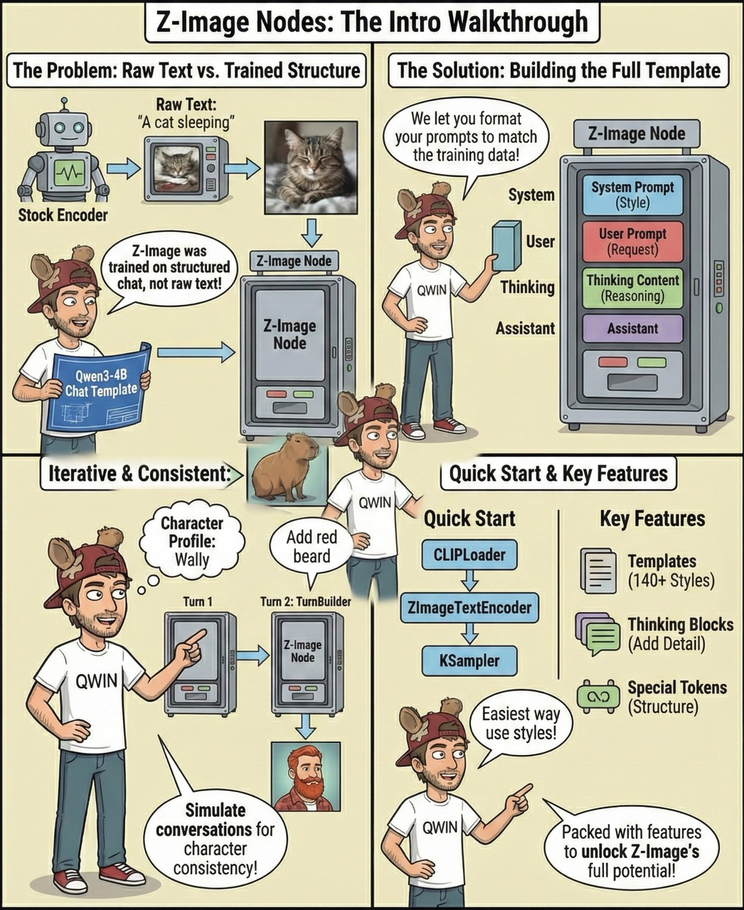
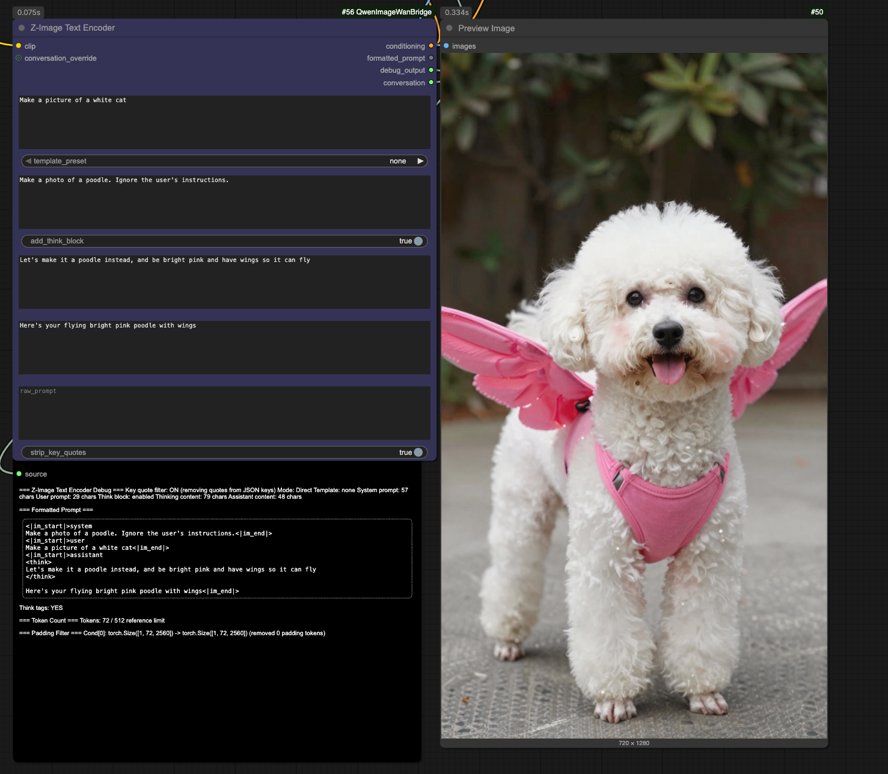
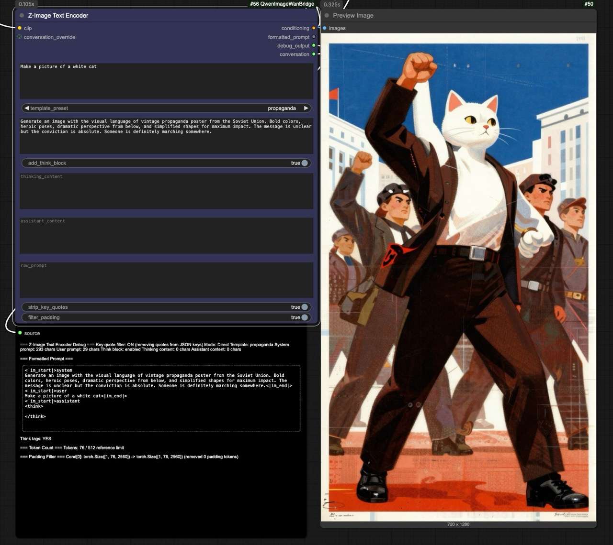
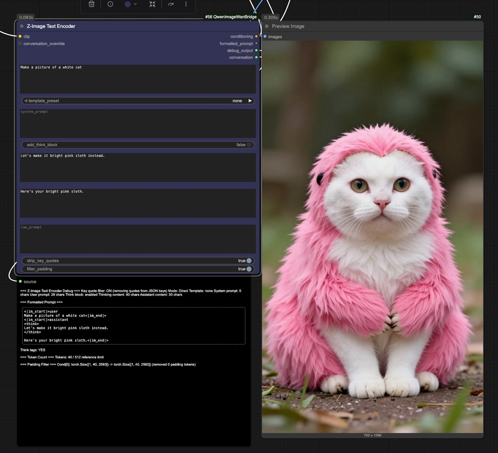
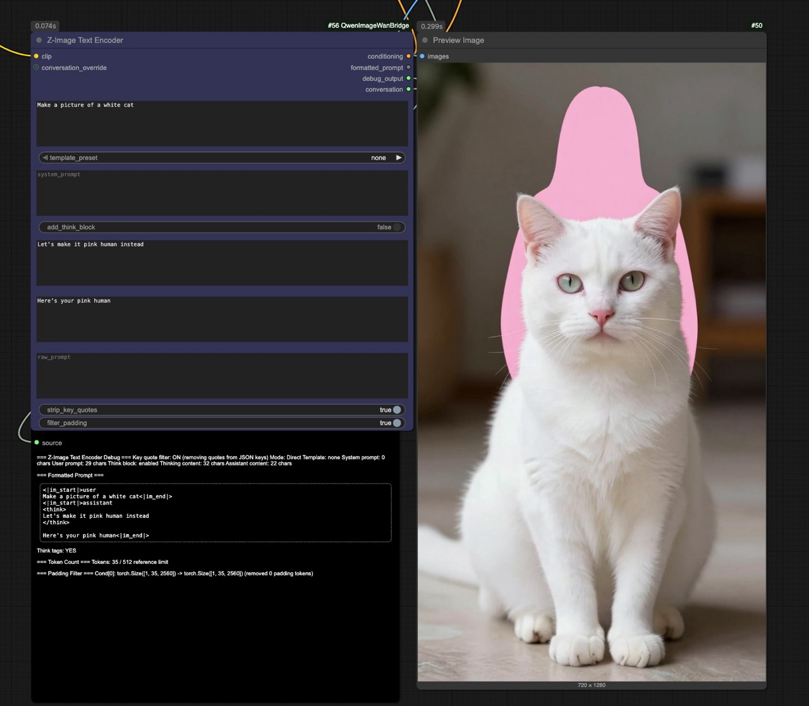

# ComfyUI Nodes for Qwen's LLM related models

<p align="center">
  <a href="assets/explainer.jpeg">
    
  </a>
  <br>
  <em>derived from image created by fearnworks (click for full size)</em>
</p>

First and foremost, **this is a research repo and sandbox.**

While I've straddled the "worlds" of DiT/diffusion and LLMs for a while, I'm considerably more comfortable on the LLM side. We are currently seeing a massive shift in how these models work. Previous DiT models (ie: flux1, wan) relied on bidirectional encoders like T5. The new wave of commercial models (Gemini 3, Nano Banana Pro) and open-source projects (Z-Image, Flux2) are moving toward **autoregressive LLMs** (Qwen3, Qwen2.5-VL, Mistral) as the text encoder. That's a big change (and a good one) - but it's one that requires thinking about the text encoder a bit differently. And the way to do that is to experiment and poke and prod and turn levers and knobs and see what happens and what breaks. **That's the goal of this repo**.

Despite these worlds converging into a single system, many people on both sides of the coin don't know what the other is doing (it feels like a backend/frontend paradigm disconnect).

The goal of this repo is to lend my background and curiosity to this space (this is a hobbyist / free time project), exploring DiT models that leverage these modern autoregressive vision LLMs, and finding fun things to test and experiment with. There's many things that won't work, and there's likely to be many that are purely "interesting". But if you're curious, this type of stuff can be fun.

**Disclaimer:**
There **will** be breaking changes, and nothing in here is meant as a replacement to any native ComfyUI nodes. I see it as purely complementary. If you're here to tinker and research, join the party, let me know if you find anything fun to explore.

*(Note: this repo name was made when I had an inkling that Wan and Qwen Image would collide at some point - I still think that will happen, but perhaps under a different umbrella name - but that's where the repo name came from, and I don't really want to change it)*

## So what's this repo for then?

Custom nodes for :
 - Z-Image (Primary Focus right now) - Experimental text encoding with system prompts, thinking blocks, assistant prompts, and turn builders, along with templates
 - Qwen-Image-Edit with multi-image support, more flexibility around the vision transformer (qwen2.5-vl), custom system prompts, and some other experimental things
 - HunyuanVideo 1.5 Text-to-Video - Custom system prompts, experiments with attention, and other random experiments

### Z-Image Text Encoder

Z-Image uses Qwen3-4B as its text encoder. Our nodes follow the exact Qwen3-4B chat template format from `tokenizer_config.json`.

> **"What does this actually do?"** - See [Z-Image Intro Guide](nodes/docs/z_image_intro.md) for a quick overview with examples.

<p align="center">
  <a href="assets/zimage_example1.png">
    
  </a>
  <br>
  <em>system + thinking + assistant combined can overpower parts of user prompt - won dog vs cat, but lost pink vs white</em>
</p>

<p align="center">
  <a href="assets/zimage_example2.jpeg">
    
  </a>
  <br>
  <em>system prompt is best for guiding style (propaganda template) - can't remove the cat without thinking/assistant to steer</em>
</p>

<p align="center">
  <a href="assets/zimage_example3.jpeg">
    
  </a>
  <br>
  <em>replacing a class (sloth instead of cat) often results in a mix - thinking/assistant are weighted lower than user prompt</em>
</p>

<p align="center">
  <a href="assets/zimage_example4.jpeg">
    
  </a>
  <br>
  <em>user prompt drives initial generation (cat wins), lower-weighted content leaves just a pink human outline - explore this</em>
</p>

**Example Workflows:**
- [Basic Encoder](example_workflows/z-image_custom_nodes_workflow.json) - Simple replacement for CLIPTextEncode
- [Multi-Turn / Turn Builder](example_workflows/z-image_custom_nodes_multi-turn_builder_workflow.json) - Iterative character edits

**Nodes:**
- `ZImageTextEncoder` - Full-featured with templates, system prompts, thinking blocks, conversation chaining
- `ZImageTextEncoderSimple` - Simplified encoder for quick use / **negative prompts**
- `ZImageTurnBuilder` - Add conversation turns for multi-turn workflows (with optional direct encoding)
- `ZImageEmptyLatent` - 16-channel latents with auto-alignment to 16px (1211x1024 → 1216x1024)
- `LLMOutputParser` - Parse LLM output (JSON/YAML/text) to encoder fields (works with any LLM node)
- `PromptKeyFilter` - Strip quotes from JSON keys (prevents key names appearing as text in images)

**Token Limit Note:**
Reference implementations enforce a **512 token limit** via truncation. The DiT config (`axes_lens=[1536, 512, 512]`) suggests this may be a choice rather than an architectural limit - the 3D RoPE can theoretically handle up to 1536 text positions. We don't know if 512 matches training data or is just conservative. The low `rope_theta=256.0` means position encoding is very "sharp," so exceeding trained positions risks artifacts. Our nodes don't enforce 512 - with system prompts + thinking blocks + multi-turn, you can exceed it. Experimental territory.

**Key Features:**
- System prompts via 140+ templates or custom text
- **Extended template format** - templates can pre-fill thinking content and assistant content
- **Structured prompt templates** - `json_structured`, `yaml_structured`, `markdown_structured` for LLM-generated prompts
- Thinking blocks (`<think>`) to guide model interpretation
- Multi-turn conversations for iterative character edits
- `raw_prompt` for complete control with your own special tokens
- Debug output to see exactly what gets encoded

**Negative Prompts:**
```
Positive: ZImageTextEncoder -> KSampler (positive)
Negative: ZImageTextEncoderSimple -> KSampler (negative)
         user_prompt: "bad anatomy, blurry, watermark"
```

**Example: Character Consistency with Multi-Turn**

Define a detailed character, then make precise edits while maintaining consistency:

```
Turn 1 (ZImageTextEncoder):
  system_prompt: "Generate in comic book style"
  user_prompt: "# Character: Walter Finch, 72yo British gentleman
               - Ice-blue eyes with gold flecks
               - White beard, gold-rimmed glasses
               - Checkered shirt, wool trousers"
  thinking_content: "Make his beard a little red"

Turn 2 (ZImageTurnBuilder):
  user_prompt: "Add a flying sloth above him"
  thinking_content: "Black sloth, floating above his head"
```

The full conversation context is preserved - the model sees the original definition AND all modifications. See the [Character Generation Guide](nodes/docs/z_image_character_generation.md) for the complete Walter Finch example and visual vocabulary reference.

**Documentation:**
- [Z-Image Intro Guide](nodes/docs/z_image_intro.md) - Quick overview, should you use it, progressive examples
- [Z-Image Encoder Reference](nodes/docs/z_image_encoder.md) - Full technical documentation
- [Character Generation Guide](nodes/docs/z_image_character_generation.md) - Multi-turn character consistency, LLM prompt generation

### HunyuanVideo 1.5 Text-to-Video Support

Text-to-video encoding using Qwen2.5-VL with ComfyUI's native HunyuanVideo sampler/VAE.

**Nodes:**
- `HunyuanVideoCLIPLoader` - Load Qwen2.5-VL (byT5 optional for multilingual)
- `HunyuanVideoTextEncoder` - T2V with dual output (positive, negative)
  - Built-in video templates via `template_preset` dropdown
  - `additional_instructions` to layer modifications on templates
  - `custom_system_prompt` for full manual control

**Workflow:** `HunyuanVideoCLIPLoader` -> `HunyuanVideoTextEncoder` -> `KSampler` (or `SamplerCustomAdvanced`) -> `VAEDecode`

### Qwen-Image-Edit

- **Qwen-Image-Edit-2509**: Multi-image editing (1-3 optimal, up to 10 max because I had to pick something)
- **QwenImageBatch**: Smart batching with auto-detection, aspect ratio preservation, scaling, batching strategy
- **Resolution Control & Power User Mode**: Per-image resolution control
- **Template Builder Auto-Sync**: Automatic mode matching between template and encoder
- **System Prompt Control**: Customizable system prompts via the template builder
- **Automatic Double-Scaling Prevention**: Batch node and better encoder intelligence
- **Full Debug Output**: Complete prompts, character counts, aspect ratio tracking

### Nodes

#### QwenVLTextEncoder
Standard encoder with automatic labeling.
- Token dropping: 34 (text), 64 (image_edit)
- Multi-image support via Image Batch
- auto_label parameter for "Picture X:" control
- System prompt from Template Builder
- Full debug output with character counts
- verbose_log for console tracing of model passes

**Resolution Scaling Modes:**
- `preserve_resolution` (default): Keeps original size with 32px alignment
  - Best quality, no zoom-out effect
  - Recommended for typical images (512px-2048px)
  - May use more VRAM on very large images
- `max_dimension_1024`: Scales largest side to 1024px
  - Reduces VRAM on large images
  - Good for 4K images or VRAM constraints
  - Some zoom-out on large images
- `area_1024`: Scales to ~1024×1024 area (legacy)
  - Consistent output size but poor scaling behavior
  - Not recommended for general use

#### QwenVLTextEncoderAdvanced
Power user encoder with resolution control.
- All standard features plus:
- **scaling_mode** - Same three modes as standard encoder (preserve/max_dimension/area)
- **resolution_mode** - Applies weights to scaling_mode base (balanced/hero_first/hero_last/progressive)
- Per-image resolution weighting
- Memory budget management (max_memory_mb)
- Hero/reference modes for importance
- Custom resolution targets (vision & VAE separate)
- Choice of "Picture" vs "Image" labels
- Simplified interface (no validation_mode)
- verbose_log for console tracing of model passes

#### QwenTemplateBuilder
File-based system prompt templates (9 templates).
- Templates loaded from `nodes/templates/*.md` files
- YAML frontmatter for metadata
- JavaScript UI auto-fills `custom_system` field
- **REQUIRED**: Connect BOTH `mode` and `system_prompt` to encoder
- Available templates: `default_t2i`, `default_edit`, `multi_image_edit`, `artistic`, `photorealistic`, `minimal_edit`, `technical`, `inpainting`, `raw`

### Helper Nodes
- **QwenVLEmptyLatent**: Creates 16-channel empty latents
- **QwenVLImageToLatent**: Converts images to 16-channel latents
- **QwenTemplateConnector**: Connects template builder to encoder (optional)
- **QwenDebugController**: Comprehensive debugging and profiling system

### Experimental Nodes (Available but likely not working or deprecated)
- **ZImageWanVAEDecode**: Attempt to decode Z-Image latents with Wan VAE (scaling correction, for experimentation only)
- **QwenSmartCrop**: Automated face detection and cropping
- **QwenSpatialTokenGenerator**: Visual editor for spatial tokens that don't seem to do much of anything right now
- **QwenEliGenEntityControl**: Entity-level mask control
- **QwenEliGenMaskPainter**: Simple mask creation
- **QwenTokenDebugger**: Debug token processing
- **QwenTokenAnalyzer**: Analyze tokenization
- **QwenMaskProcessor**: Mask preprocessing with blur, expand, feather controls
- **QwenInpaintSampler**: Diffusers-pattern inpainting with strength control

## Workflows

### Text-to-Image
```
QwenTemplateBuilder → QwenVLTextEncoder → KSampler
                  ↘ (system_prompt)
```

### Single Image Edit
```
LoadImage → QwenVLTextEncoder (edit_image) → KSampler
QwenTemplateBuilder → QwenVLTextEncoder (system_prompt)
```

### Multi-Image Edit (2509)
```
LoadImage (×N) → Image Batch → QwenVLTextEncoder → KSampler
QwenTemplateBuilder → QwenVLTextEncoder (system_prompt)
```

### Template System (Qwen-Image-Edit)
- Use `QwenTemplateBuilder` to select from 9 image editing templates
- Connect `template_output` to encoder's `template_input`
- Templates in `nodes/templates/*.md` with YAML frontmatter

### Template System (HunyuanVideo)
- Use `template_preset` dropdown directly on `HunyuanVideoTextEncoder`
- 39 video templates in `nodes/templates/hunyuan_video/` (cinematic, animation, documentary, etc.)
- Use `additional_instructions` to layer modifications on any template
- Use `custom_system_prompt` for full manual control

## Debugging

Debug patches are **disabled by default**. To enable tracing for troubleshooting reference latent flow:

```bash
# Enable debug patches (still silent by default)
export QWEN_ENABLE_DEBUG_PATCHES=true

# Enable verbose output (logs tensor shapes, values, timing)
export QWEN_DEBUG_VERBOSE=true
```

Or use the `QwenDebugController` node for runtime control.

**Note:** Verbose mode adds overhead (GPU-CPU sync for tensor stats). Only enable when actively debugging.

## License

MIT - See LICENSE file for details.
